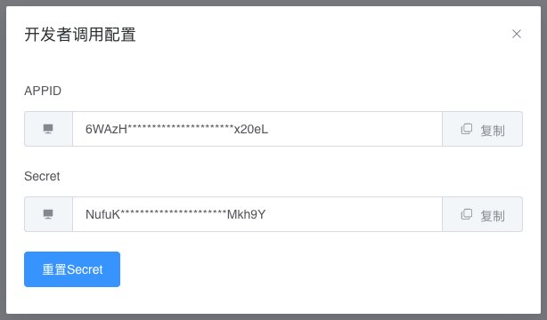

# CubeX AI Go语言SDK

---

基于Go语言开发，只需要一行代码，只用强大的AI能力。

👉 CubeX AI: [CubeX AI官网](https://www.airb3.com.cn/?ref=github)
👉 API文档：[API文档](https://apifox.com/apidoc/shared-c2de4a48-bf44-4a6c-aacc-554885ac180e)
👉 官方公众号：CubeX AI


---

#### 前置准备
* 官网申请APIkey和APISecret

#### 1. 快速开始
##### 1.1. 引入sdk

```
go get github.com/cubexai/cubexai-sdk-go
```

##### 1.2. 在CubeX AI官网获取API调用密钥对


##### 1.3. 初始化Client对象，传入sdk密钥对配置

**注意：**
1.`completion`接口是异步的，发送请求成功后，接口会同步返回一个`aid`参数，此参数是消息ID。
2.通过获得的`aid`参数，轮循调用请求消息接收接口获得AI回复的消息内容。
3.消息获取接口有一个`status`字段，此字段的值枚举有3种情况：
    * `RUN` 代表AI正在回复内容，此种情况需要继续轮询消息查询接口。
    * `LENGTH` 代表内容超过长度，需要回复【继续】指令以继续生成。
    * `END` 为输出结束，调用端应停止轮询请求。
4.消息内容在`status`状态变成`LENGTH`或`END`后，保留1分钟，请及时获取消息内容并做好缓存或落库。
```
package main

import (
	"github.com/cubexai-sdk-go/utils"
	"fmt"
)

func main() {
	appid := "6WAz************************0eL"
	secret := "Nuf*************************h9Y"

	QueryMessage(appid, secret, "b8c24e81-cdcb-4aae-a7cf-abcdefg")
	SendMessage(appid, secret, "你好啊")
}

// 接收消息
func QueryMessage(appid, secret, aid string) {

	params := utils.CubeXAIMessageRequest{
		Aid: aid,
	}

	api := "https://chat.airb3.cn/api/v1/openapi/chat/query"

	client := utils.NewHttpClient(appid, secret)

	result, _err := client.DoGet(api, params)
	fmt.Println(string(result), _err)
}

// 发送消息
func SendMessage(appid, secret, content string) {

	params := &utils.CubeXAICompletionRequestBody{
		ModelId: "7d0fce18-0f36-4e01-9952-abcdefghijk",
		Messages: []utils.CubeXAICompletionRequestBodyMessages{
			{
				Role:    "user",
				Content: content,
			},
		},
	}

	api := "https://chat.airb3.cn/api/v1/openapi/chat/completions"

	client := utils.NewHttpClient(appid, secret)

	result, _err := client.DoPost(api, params)
	fmt.Println(string(result), _err)
}
```

##### 1.4 参数结构

###### 1.4.1 请求参数结构

* Completion接口
    * ModelId 模型ID，需要在官网已有的模型中查询
    * Messages 消息内容数组，可以携带多条历史记录，最新的消息放到最后。
        * -Messages.Role 可选值有`system`,`assistant`,`user`
        * -Messages.Content 消息内容正文
```
type CubeXAICompletionRequestBody struct {
	ModelId  string                                 `json:"mid"`
	Messages []CubeXAICompletionRequestBodyMessages `json:"messages"`
}

type CubeXAICompletionRequestBodyMessages struct {
	Role    string `json:"role"`
	Content string `json:"content"`
}
```

* QueryMessage接口
    * Aid 消息ID
```
type CubeXAIMessageRequest struct {
	Aid string `json:"aid"`
}
```

###### 1.4.2 响应参数结构

* Code参数值为10000，且响应码为`200`时，代表请求成功，其他均为异常
    

```
type CubeXAIMessageResponse struct {
	Code    uint64                     `json:"code"`
	Message string                     `json:"message"`
	Data    interface{}                `json:"data"`
}
```

#### 1.5 签名认证

**温馨提示：** sdk已经内置签名认证方法，可以调用sdk的`doGet`或者`doPost`方法发起请求，可一步到位。

为了确保API请求的安全性，我们实施了一种基于HMAC的请求签名机制。每个API请求都需要包含以下几个HTTP头部字段：`X-APPID`，`X-TIMESTAMP`，`X-NONCE`，和`X-SIGNATURE`。

* `X-APPID`：由后端颁发的应用程序标识符。
* `X-TIMESTAMP`：请求发起的Unix时间戳。
* `X-NONCE`：用于保证每次签名的唯一性的随机字符串。
* `X-SIGNATURE`：基于HMAC生成的请求签名。
签名过程如下：

将请求体（如果存在）的参数按照字典序排序，并使用等号（=）进行键值对的拼接，然后用和号（&）连接所有的键值对，生成待签名字符串。

使用后端颁发的`SECRET`和待签名字符串，通过HMAC算法生成签名字符串。

服务器会对请求的`X-TIMESTAMP`进行校验，如果请求的时间戳低于服务器时间戳或者超过服务器时间戳`30秒`，都会导致验签失败。

